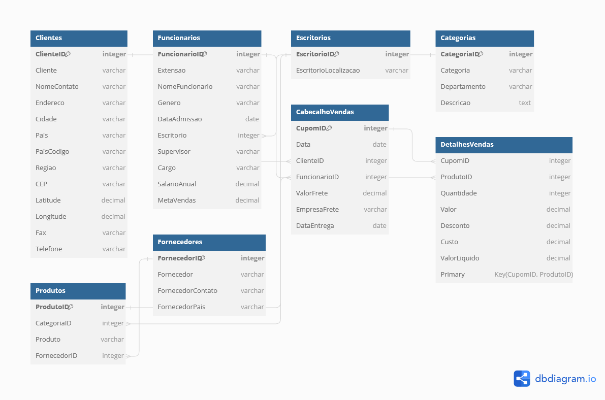

# Desafio 1 - Consulta em SQL

## Visão Geral
Este projeto de análise de dados de vendas foi realizado utilizando o DuckDB como banco de dados SQL OLAP, com as consultas sendo desenvolvidas e executadas no [Jupyter Colab](https://colab.research.google.com/drive/1pmCI7kiTupGASUEOy-hh11rl3lJQqh-A#scrollTo=WhBFngCvuLZ9).

## Análise de Vendas
Nossa análise explora diversas facetas dos dados de vendas para extrair insights valiosos, abordando questões críticas de negócios por meio das seguintes consultas SQL:

### 1. Valor Total das Vendas e Fretes
- **Arquivo:** [query_01_1_total_vendas.sql](./analysis/query_01_1_total_vendas.sql)  
  **Descrição:** Esta consulta calcula o valor total das vendas e dos fretes para cada combinação de ProdutoID e CupomID.

#### 1.1 Valor Total das Vendas e Fretes por Ordem
- **Arquivo:** [query_01_2_total_vendas_por_ordem.sql](./analysis/query_01_2_total_vendas_por_ordem.sql)  
  **Descrição:** Esta consulta foca em métricas de vendas e fretes para cada CupomID.

#### 1.2 Valor Total das Vendas e Fretes por Produto
- **Arquivo:** [query_01_3_total_vendas_por_produto.sql](./analysis/query_01_3_total_vendas_por_produto.sql)  
  **Descrição:** Esta consulta analisa as métricas de vendas e fretes para cada ProdutoID.

### 2. Valor de Venda por Tipo de Produto
- **Arquivo:** [query_02_total_vendas_tipo.sql](./analysis/query_02_total_vendas_tipo.sql)  
  **Descrição:** Calcula o valor total de vendas para cada categoria de produtos.

### 3. Quantidade e Valor das Vendas por Período
- **Arquivo:** [query_03_quantidade_vendas_periodo.sql](./analysis/query_03_quantidade_vendas_periodo.sql)  
  **Descrição:** Apresenta a quantidade total e o valor total das vendas, segmentados por dia, mês e ano.

### 4. Lucro dos Meses
- **Arquivo:** [query_04_lucro_mes_ano.sql](./analysis/query_04_lucro_mes_ano.sql)  
  **Descrição:** Calcula o lucro mensal ao longo de um intervalo de anos específico.

### 5. Venda por Produto
- **Arquivo:** [query_05_vendas_produto.sql](./analysis/query_05_vendas_produto.sql)  
  **Descrição:** Fornece a quantidade total de vendas por produto, destacando os mais vendidos.

### 6. Venda por Cliente, Cidade e Estado
- **Arquivo:** [query_06_vendas_cliente_cidade_estado.sql](./analysis/query_06_vendas_cliente_cidade_estado.sql)  
  **Descrição:** Explora a quantidade total de vendas por cliente, detalhada por cidade e estado.

### 7. Média de Produtos Vendidos
- **Arquivo:** [query_07_media_produtos_vendidos.sql](./analysis/query_07_media_produtos_vendidos.sql)  
  **Descrição:** Calcula a média de produtos vendidos por ano e a variação percentual em relação ao ano anterior.

### 8. Média de Compras por Cliente
- **Arquivo:** [query_08_media_compras_cliente.sql](./analysis/query_08_media_compras_cliente.sql)  
  **Descrição:** Apresenta a média geral de compras por cliente, a média anual e a variação percentual anual.

## Estrutura dos Dados
A estrutura dos dados é detalhada no seguinte diagrama:

## Processo de Criação de Tabelas e Preparação de Dados
As tabelas de dados foram criadas e preparadas utilizando scripts SQL no DuckDB. Os scripts detalham a importação de dados das fontes originais e ajustes nos tipos de dados para garantir a precisão das análises. Estes scripts podem ser encontrados na pasta `/data_preparation/`.

### Principais Scripts de Preparação de Dados
1. **Criação de Tabelas Dimensionais:** Scripts como `create_tabelas_dim.sql` preparam tabelas como `clientes`, `funcionarios`, `escritorios`, `categorias`, `produtos` e `fornecedores`.
2. **Criação de Tabelas Fato:** Scripts como `create_tabelas_fato.sql` preparam tabelas essenciais para análise, como `cabecalho_vendas` e `detalhes_vendas`.
3. **Atualizações de Tipo de Dados:** Scripts como `update_decimal_columns_cabecalho_vendas.sql` e `update_decimal_columns_detalhes_vendas.sql` ajustam os tipos de dados para análises mais precisas.
4. **Atualizações de Tabelas Específicas:** Scripts como `update_integer_columns_funcionarios.sql` são utilizados para correções específicas em tabelas selecionadas.

## Conclusão
Este projeto de análise de dados de vendas fornece insights valiosos sobre vários aspectos do negócio, desde a performance de vendas de produtos individuais até tendências de compra dos clientes. As análises e visualizações derivadas desses dados podem informar decisões estratégicas e operacionais, contribuindo significativamente para o crescimento e eficiência da empresa.

Para mais detalhes sobre as consultas específicas, consulte o [Jupyter Colab](https://colab.research.google.com/drive/1pmCI7kiTupGASUEOy-hh11rl3lJQqh-A#scrollTo=WhBFngCvuLZ9).
